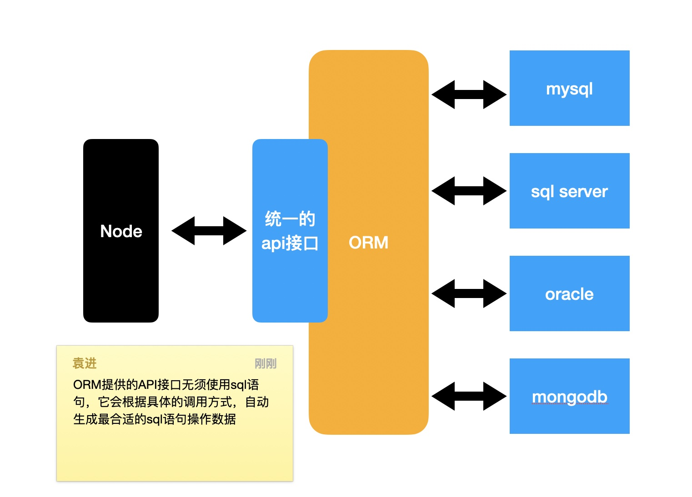
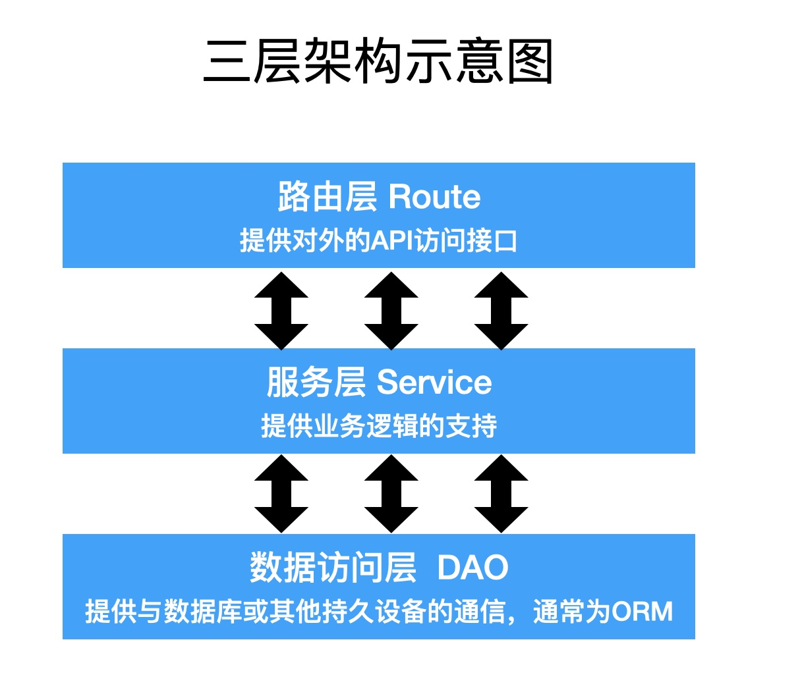

# mysql 驱动程序

## 什么是驱动程序

- 驱动程序是连接内存和其他存储介质的桥梁
- mysql驱动程序是连接内存数据和mysql数据的桥梁
- mysql驱动程序通常使用 `mysql`  `mysql2`

## 防止sql注入

sql 注入： 用户通过输入sql语句到最终查询中，导致了整个sql与预期行为不符

**mysql 支持变量** 

connection.execute()

变量的内容不作为任何sql关键字

## ORM

Object Relational Mapping `对象关系映射`
通过ORM框架，可以自动的把程序中的对象和数据库关联
ORM框架会隐藏具体的数据库底层细节，让开发者使用同样的数据操作接口，完成对不同数据库的操作

**ORM优势**

1. 开发者不用关心数据库，仅需关心对象
2. 可轻易的完成数据库的移植
3. 无须拼接复杂的sql语句即可完成精确查询

Node中的ORM

- Sequelize
  - 支持 JS、TS
  - 成熟
- TypeORM
  - 仅支持 TS `注：以支持JS?`
  - 不成熟

### 三层架构
