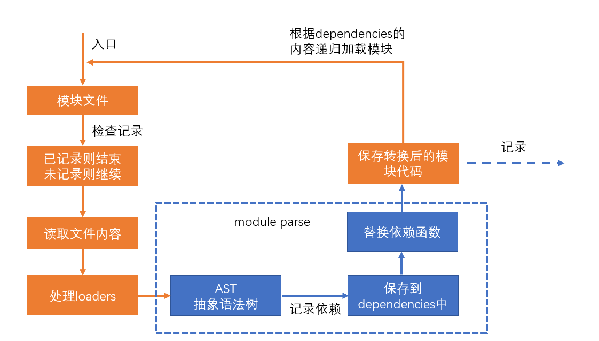
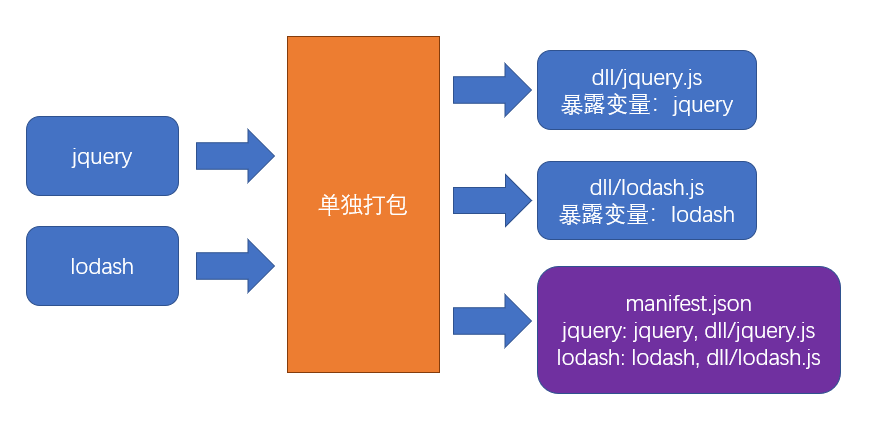
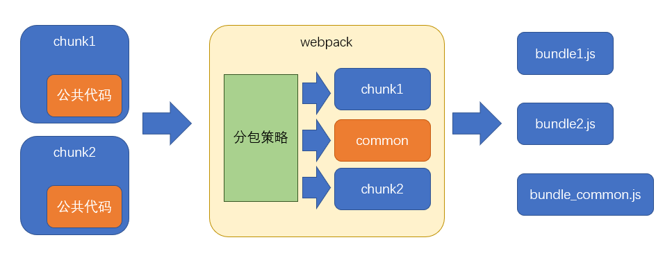

## 性能优化


性能优化主要从上面三个维度入手

`性能优化没有完美的解决方案，需要具体情况具体分析`

### 构建性能

这里所说的构建性能，是指在`开发阶段的构建性能`，而不是生产环境的构建性能

优化的目标，`是降低从打包开始，到代码效果呈现所经过的时间`

构建性能会影响开发效率。构建性能越高，开发过程中时间的浪费越少

### 传输性能

传输性能是指，打包后的JS代码传输到浏览器经过的时间

在优化传输性能时要考虑到：

``` md
总传输量：所有需要传输的JS文件的内容加起来，就是总传输量，重复代码越少，总传输量越少
文件数量：当访问页面时，需要传输的JS文件数量，文件数量越多，http请求越多，响应速度越慢
浏览器缓存：JS文件会被浏览器缓存，被缓存的文件不会再进行传输
```

### 运行性能

运行性能是指，JS代码在浏览器端的运行速度

它主要取决于我们如何书写高性能的代码

`永远不要过早的关注于性能`，因为你在开发的时候，无法完全预知最终的运行性能，过早的关注性能会极大的降低开发效率


#### 模块解析




#### 进一步限制loader的应用范围

思路是：对于某些库，不使用loader

例如：babel-loader可以转换ES6或更高版本的语法，可是有些库本身就是用ES5语法书写的，不需要转换，使用babel-loader反而会浪费构建时间

lodash就是这样的一个库

`lodash是在ES5之前出现的库，使用的是ES3语法`

``` js
module.exports = {
    module: {
        rules: [
            {
                test: /\.js$/,
                exclude: /lodash/,
                use: "babel-loader"
            }
        ]
    }
}
```


#### 缓存loader的结果

我们可以基于一种假设：如果某个文件内容不变，经过相同的loader解析后，解析后的结果也不变

于是，可以将loader的解析结果保存下来，让后续的解析直接使用保存的结果

cache-loader可以实现这样的功能

``` js
module.exports = {
  module: {
    rules: [
      {
        test: /\.js$/,
        use: ['cache-loader', ...loaders]
      },
    ],
  },
};

```

#### 开启多线程

`thread-loader`会开启一个线程池，线程池中包含适量的线程

它会把后续的loader放到线程池的线程中运行，以提高构建效率

由于后续的loader会放到新的线程中，所以，后续的loader不能：

- 使用 webpack api 生成文件
- 无法使用自定义的 plugin api
- 无法访问 webpack options

`在实际的开发中，可以进行测试，来决定thread-loader放到什么位置`

`特别注意`，开启和管理线程需要消耗时间，在小型项目中使用thread-loader反而会增加构建时间

### 手动分包

1. 先单独的打包公共模块


2. 根据入口模块进行正常打包


### 自动分包



splitChunk