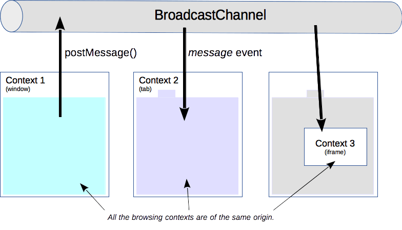

# 跨标签页通信

# 技术讲解

## 什么问题

有时候我们会有一些比较特殊的需求，比如，当产品在多个标签页上打开时，在其中一个标签页上做了操作，其他页面需要同步对应的状态，这其实就涉及到前端的跨标签页通信。

比如一个常规的业务列表页，页面中提供了一个新增功能，由于新增功能的表单项内容比较多，所以交互上使用新开一个窗口来完成。这时问题来了，在新增完成后，如何通知列表页面刷新列表数据，以便展示出刚才新增的那一条数据。

当然你无需质疑为什么在普遍使用SPA页面的现在，为啥有这种需求。如果用户的习惯是多显示屏操作呢？

这还是比较常规的需求，如果项目涉及到设计相关的，用户希望在列表页打开模板，但是想在新的标签页面展示，又不想每次点击都打开一个新的标签页，就类似于大家常见的音乐播放网站，那这种也涉及到跨页面通信

## 解决思路

首先，由于涉及到多标签页了，也就是说这种通信你不可能通过简单的**仓库保存变量**来实现，因为对于现在的前端项目来说，一个新的页面是不可能拿去到之前页面的变量的，所以我们思考的点，肯定是跨标签页的通信。

### 常见的跨标签页方案：

[BroadCastChannel](https://developer.mozilla.org/zh-CN/docs/Web/API/Broadcast_Channel_API)

LocalStorage [window.onstorage 监听](https://developer.mozilla.org/zh-CN/docs/Web/API/Window/storage_event)

[Websocket](https://developer.mozilla.org/zh-CN/docs/Web/API/WebSocket)

window.open、[window.postMessage](https://developer.mozilla.org/zh-CN/docs/Web/API/Window/postMessage)、[window.opener](https://developer.mozilla.org/zh-CN/docs/Web/API/Window/opener)

[Shared Worker](https://developer.mozilla.org/zh-CN/docs/Web/API/SharedWorker) 定时器轮询（ *setInterval* ）

[IndexedDB](https://developer.mozilla.org/zh-CN/docs/Web/API/IndexedDB_API) 定时器轮询（ *setInterval* ）

[cookie](https://developer.mozilla.org/zh-CN/docs/Web/API/Document/cookie) 定时器轮询（ *setInterval* ）

[Service Worker](https://developer.mozilla.org/zh-CN/docs/Web/API/Service_Worker_API)


### 优缺点

| API              | 跨域   | 优点                                                         | 缺点                                                         |
| :--------------- | :----- | :----------------------------------------------------------- | :----------------------------------------------------------- |
| LocalStorage     | 不支持 | 支持存储和共享数据                                           | 1.需要数据存储在本地，可能会受到安全性的影响 2.不适用于实时通信，只能通过事件监听来传递数据 |
| BroadcastChannel | 不支持 | 支持实时通信，可以广播消息给所有订阅者                       | 需要浏览器支持，不适用于IE                                   |
| SharedWorker     | 不支持 | 1.支持多个标签页共享同一个后台 线程，实现数据和消息的共享 2.不会占用渲染主线程 | 1.需要额外的开发工作，包括在后台线程中处理消息和同步数据 2.需要浏览器支持,兼容性较差 |
| window.open      | 支持   | 适用于各种浏览器，不受兼容性限制。                           | 需要从当前窗口打开另一个窗口                                 |
| WebSocket        | 支持   | 支持实时双向通信，可以在不同标签页之间进行消息传递           | 需要服务器端的支持来处理 WebSocket 连接                      |

如果仅需要实时通信使用 `BroadcastChannel` 通信是一个不错的选择，

如果需要存储数据和共享数据，且不需要实时通信，可以使用 `LocalStorage`，

对于需要复杂的协调工作和高性能的应用程序，`Shared Web Workers` 可能更适合，

如果需要支持跨域，且仅在该窗口打开另一个窗口的情况下，适合使用 `window.open + window.opener`，

如果有 `WebSocket` 服务端的支持，使用 `WebSocket` 实现实时通信和双向数据传递。

## 解决细节

选择好方案之后，实现其细节其实并不麻烦，特别是使用`BroadCastChannel`和`window.onstorage`使用起来很简单，我们这里使用`BroadCastChannel`，这个API可以在不同标签页之间广播消息。它使用类似于广播电台的模式，**发送者将消息广播到所有订阅该频道的标签页**，**该频道在同源下的所有浏览器上下文共用，一个名称只对应一个频道**



当然在使用中还有一些细节：

一个是**参数的传递**，当然无论我们传递的是数字，字符串还是对象其实都没有问题，但是如果在Vue环境里面，两个标签页在传递对象数据的时候，会报错：

```typescript
Uncaught (in promise) DOMException: Failed to execute 'postMessage' on 'BroadcastChannel': #<Object> could not be cloned.
```

因为我们现在是两个标签页，一个标签页的数据要到另外一个标签页去，那只能clone，不可能出现两个标签页共用一个对象地址的情况。不过现在**默认使用的克隆方式是结构化克隆算法**，并不能处理在Vue中的响应式数据。解决的办法很简单，**解构响应式数据，编程一个简单对象数据传递即可**。

另外一个问题是，当我们离开页面的时候，应该**取消BroadCastChannel的监听**。

另外如果存在比较复杂情况的话，在创建频道的时候应该考虑是否需要定义相应的协议，保证其唯一性。
