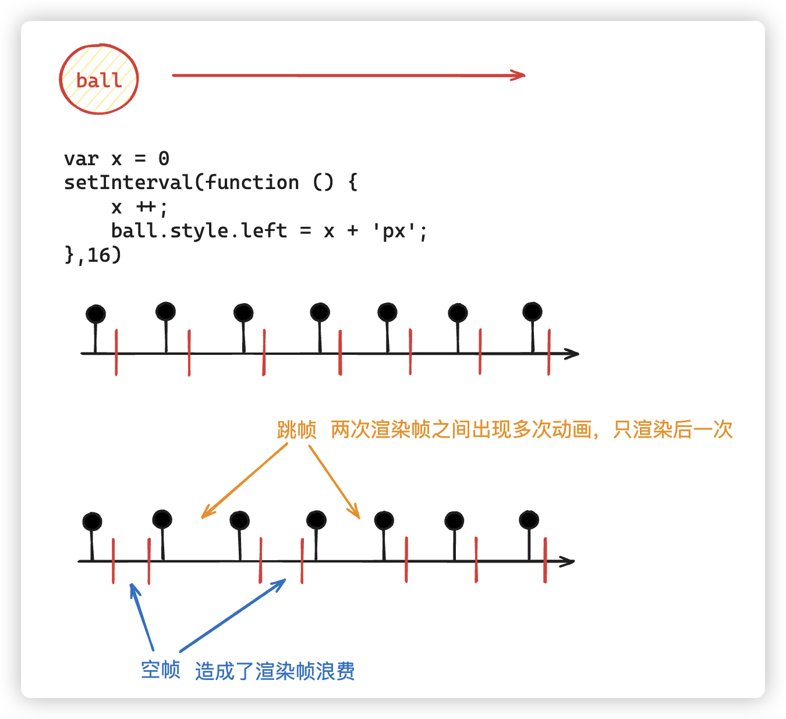
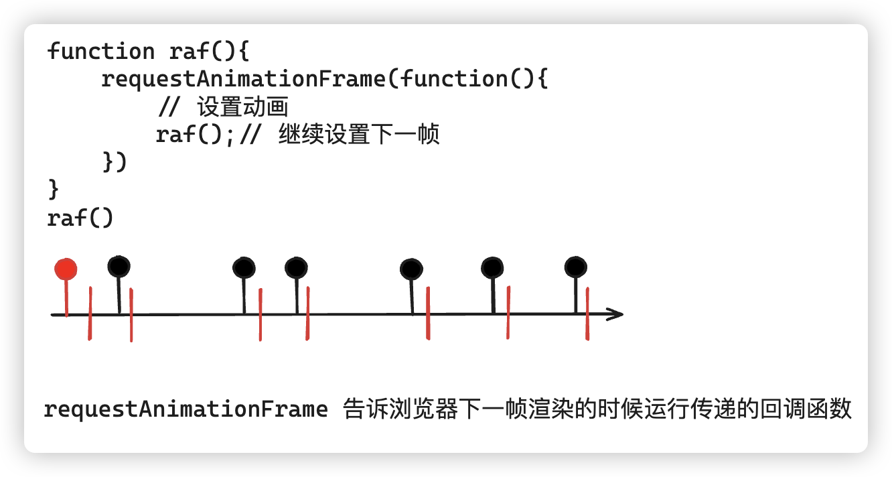
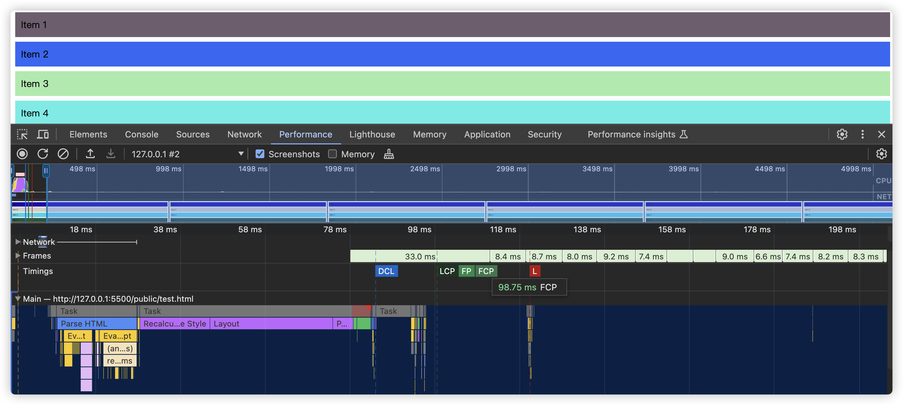
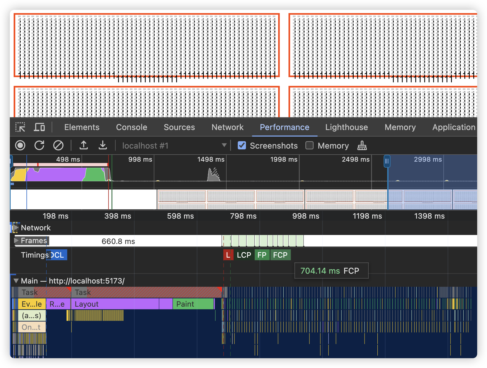
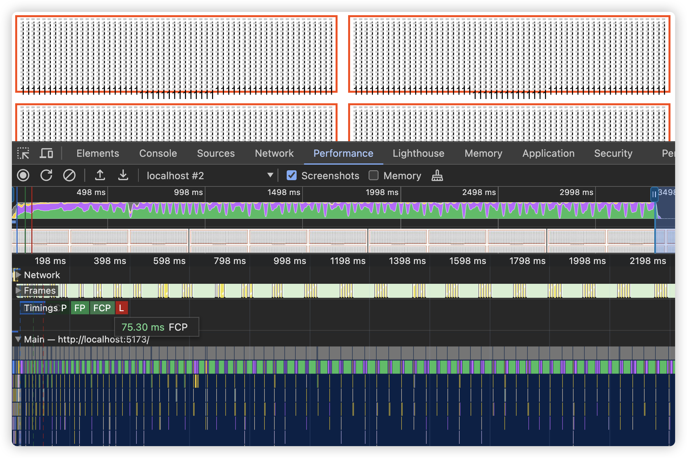

# defer优化白屏时间

# 技术讲解

## 什么问题

当我们出现白屏时间太久的情况，那当然就需要进行相关优化，关于白屏出现的情况非常的多，这个当然我们需要通过指标，进行相关的分析，得出结论。

其中一种最常见的导致页面白屏时间过长的原因，就是界面需要渲染的内容过多，渲染时间过长导致的白屏问题

## 解决思路

由于页面复杂，所以首先考虑的优化手段是方向明确、效果明确的，不会对页面业务造成过多影响的优化手段。考虑的以下的手段：

- 骨架屏
- SSR DOM直出
- 分屏加载

**骨架屏虽然有利于FCP的数据展现，但是指标不治本**，用户的需求是能在首屏马上看到内容，而不是用一个骨架屏的假象替换，只能说给用户心理安慰，当前页面在做事情，请稍等。但是有一些用户甚至会十分厌恶骨架屏的出现，因为出现就意味着速度慢。

**SSR DOM直出可以直观的减少页面二次请求和渲染**，但是如果本身页面就有很多内容需要渲染的话，也并不是最合适的手段，而且SSR并不是说上就上的，我们还需要考虑成本的问题。计算的成本是抛给前端，还是全部压在后端，这是需要平衡的。后端需要的算力不一样，所需要的服务器也就不一样，成本当然也就不一样。

**分屏加载，主要是利用[IntersectionObserver API](https://developer.mozilla.org/zh-CN/docs/Web/API/IntersectionObserver)观察 DOM 元素是否在视口内的方式实现懒加载**，当然这种一般都用在页面比较有明显分界线，比如分页情况，比如图片的懒加载等等。

但是我们的要求是一开始就需要渲染出所有的内容，比如本身当前视口的DOM内容就非常复杂，只不过相当多的内容是出于隐藏状态的，只有触发某个事件的时候，才会显示相应内容，这种情况分屏显示并不能很好的处理。

- [requestIdleCallback](https://developer.mozilla.org/zh-CN/docs/Web/API/Window/requestIdleCallback)空闲时优化渲染

`requestIdleCallback` 可以在浏览器的空闲时间执行一些低优先级的任务，从而避免阻塞主线程，提高页面的响应速度。

- [requestAnimationFrame](https://developer.mozilla.org/zh-CN/docs/Web/API/Window/requestAnimationFrame)分帧渲染

`requestAnimationFrame` 是一个用于在下一个浏览器重绘之前执行回调函数的方法。它可以用于创建流畅的动画效果

## 解决细节

### 1、[web-vitals](https://web.dev/explore/metrics?hl=zh-cn)

### 2、[requestAnimationFrame](https://developer.mozilla.org/zh-CN/docs/Web/API/Window/requestAnimationFrame)

可能我们所知道的`requestAnimationFrame` 主要作用是用于动画，但它也非常适合用于优化页面的 DOM 渲染，它可以将一系列 DOM 操作分散到多个帧中进行，从而避免阻塞主线程，提升页面的响应速度和流畅度。

**浏览器的渲染机制**：

- 浏览器每秒会尝试刷新屏幕 60 次（60fps），**每次刷新**（忽略解析Parse阶段）都会经历以下几个步骤：
  - 计算样式（Style Calculations）
  - 布局（Layout）
  - 绘制（Paint）
  - 合成（Composite）
- `requestAnimationFrame` 会在浏览器进行这些步骤之前调用你的回调函数，这样可以确保 DOM 操作和样式计算在同一个刷新周期内完成，避免多次重排和重绘。

**结合setInterval对比理解：**

**setInterval动画的情况**



**使用RAF的情况：**



**避免阻塞主线程**：

- 当你一次性进行大量 DOM 操作时，会阻塞主线程，导致页面卡顿。通过将这些操作分散到多个帧中，`requestAnimationFrame` 可以将大任务分解成小任务，逐步完成，减少主线程的阻塞时间。
- `requestAnimationFrame` 会根据屏幕刷新率进行调用，确保每次 DOM 操作都尽可能在下一次重绘之前完成，从而提供平滑的用户体验。

#### 逐帧渲染 DOM 的步骤

1. **分解大任务**：
   - 将一个大的 DOM 操作任务分解为多个小任务，每个任务操作一部分 DOM。
2. **递归调用 `requestAnimationFrame`**：
   - 使用递归的方式逐步执行这些小任务，每次执行完一个小任务后，调用 `requestAnimationFrame` 进行下一次渲染。

```js
<!DOCTYPE html>
<html lang="en">
  <head>
    <meta charset="UTF-8" />
    <title>Progressive List Rendering</title>
    <style>
      * {
        margin: 0;
        padding: 0;
      }
      li {
        margin: 8px;
        padding: 10px;
        list-style: none;
      }
    </style>
  </head>
  <body>
    <ul id="list"></ul>
    <script>
      const list = document.getElementById("list");
      const items = Array.from({ length: 10000 }, (_, i) => `Item ${i + 1}`);

      // 直接循环渲染
      /* function renderItems(startIndex, batchSize) {
        for (
          let i = startIndex;
          i < startIndex + batchSize && i < items.length;
          i++
        ) {
          const li = document.createElement("li");
          li.textContent = items[i];
          // 随机背景颜色
          li.style.backgroundColor = `#${Math.floor(
            Math.random() * 16777215
          ).toString(16)}`;
          list.appendChild(li);
        }
      }

      // 直接循环调用renderItems，每次20
      for (let i = 0; i <= 10000; i += 20) {
        renderItems(i, 20);
      } */

			// 分帧渲染
      function renderItems(startIndex, batchSize) {
        for (
          let i = startIndex;
          i < startIndex + batchSize && i < items.length;
          i++
        ) {
          const li = document.createElement("li");
          li.textContent = items[i];
          // 随机背景颜色
          li.style.backgroundColor = `#${Math.floor(
            Math.random() * 16777215
          ).toString(16)}`;
          list.appendChild(li);
        }

        if (startIndex + batchSize < items.length) {
          requestAnimationFrame(() =>
            renderItems(startIndex + batchSize, batchSize)
          );
        }
      }

      requestAnimationFrame(() => renderItems(0, 20)); // 每次渲染20个项
    </script>
  </body>
</html>

```

**直接渲染：**



**分帧渲染**


把这个用到vue的框架中，无非也就是组件`v-if`是否渲染，通过`requestAnimationFrame`来进行控制，那我们就可以封装成一个Composables(Hooks)函数，比如`useDefer`

```js
import { onUnmounted, ref } from 'vue';

export function useDefer(maxCount = 100) {
  const count = ref(0);
  let raqId = null;
  function updateFrame() {
    count.value++;
    if (count.value >= maxCount) {
      return;
    }
    raqId = requestAnimationFrame(updateFrame);
  }
  updateFrame();
  onUnmounted(() => {
    cancelAnimationFrame(raqId);
  });
  return function (n) {
    return count.value >= n;
  };
}
```


**直接渲染：**



**分帧渲染**


